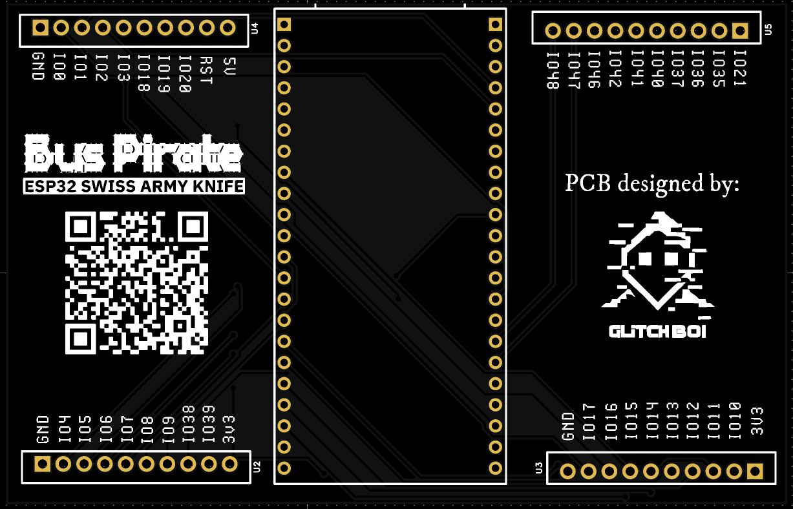

# Buspirate Main

## Imagen

---

## Descripción

PCB principal del proyecto ESP32 Piratebus Kit. Esta placa actúa como el cerebro del sistema, basada en el microcontrolador **ESP32** y compatible con el firmware de [ESP32-Bus-Pirate](https://github.com/geo-tp/ESP32-Bus-Pirate).

Integra todas las interfaces necesarias para comunicarse con los módulos periféricos (NFC, Ethernet, Sub-GHz) y proporciona conectividad USB para programación y comunicación serial.

---

## Características

- Microcontrolador **ESP32** (dual-core, Wi-Fi, Bluetooth)
- Puerto USB para programación y comunicación
- Headers de expansión para módulos adicionales
- Soporte para protocolos: UART, SPI, I2C, JTAG
- Compatible con firmware ESP32-Bus-Pirate

---

## Archivos

| Archivo | Descripción |
|---------|-------------|
| `Buspirate_Main.epro` | Proyecto EasyEDA Pro |
| `Buspirate_Main.zip` | Gerbers para fabricación |

[← Volver al README principal](../README.md)
