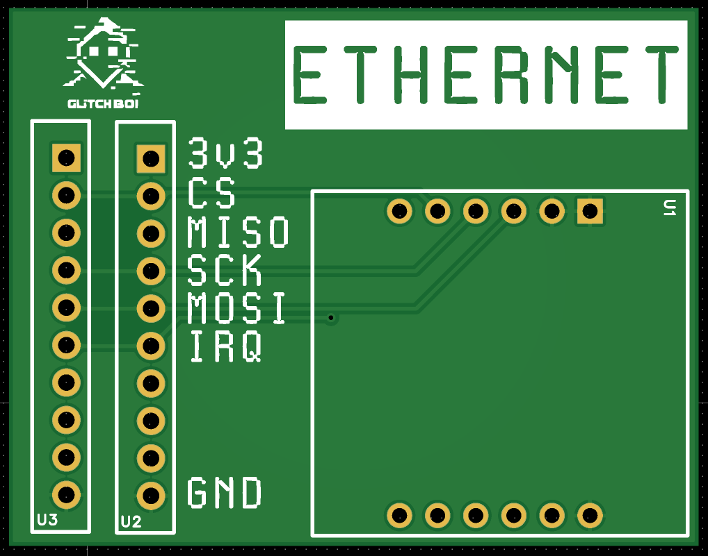

# Ethernet Module

## Imagen

---

## Descripción

Módulo de red **Ethernet** basado en el chip **W5500** de WIZnet. Proporciona conectividad de red cableada al kit, permitiendo realizar análisis de tráfico, sniffing de paquetes y pruebas de seguridad en redes locales.

---

## Características

- Chip **W5500** de WIZnet
- Velocidad: **10/100 Mbps**
- Conector RJ45 integrado con transformador
- Stack TCP/IP por hardware:
  - TCP, UDP, ICMP, IPv4
  - ARP, IGMP, PPPoE
- 8 sockets simultáneos
- Buffer interno de 32KB para TX/RX
- Interfaz: **SPI** (hasta 80 MHz)
- Bajo consumo de energía

---

## Casos de Uso

- Sniffing de tráfico de red local
- Análisis de protocolos de red
- Man-in-the-middle en redes cableadas
- Pruebas de penetración en infraestructura de red
- Inyección de paquetes

---

## Archivos

| Archivo | Descripción |
|---------|-------------|
| `EthernetModule.epro` | Proyecto EasyEDA Pro |
| `Ethernet_Module.zip` | Gerbers para fabricación |

[← Volver al README principal](../README.md)
