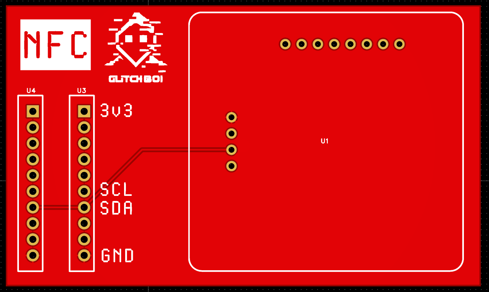

# NFC Module

## Imagen

---

## Descripción

Módulo de comunicación **NFC/RFID** basado en el chip **PN532**. Permite la lectura, escritura y emulación de tarjetas NFC, lo que lo hace ideal para investigación de seguridad en sistemas de control de acceso, pagos sin contacto y tags RFID.

---

## Características

- Chip **PN532** de NXP
- Frecuencia de operación: **13.56 MHz**
- Soporta protocolos:
  - ISO/IEC 14443 Type A y B
  - ISO/IEC 18092 (NFC)
  - Mifare Classic, Ultralight, DESFire
  - FeliCa
- Modos de operación:
  - **Lector/Escritor**: Lee y escribe tags NFC
  - **Emulación de tarjeta**: Simula una tarjeta NFC
  - **Peer-to-peer**: Comunicación entre dispositivos NFC
- Interfaz: SPI / I2C / UART (configurable)

---

## Casos de Uso

- Clonación y análisis de tarjetas de acceso
- Emulación de tarjetas para pruebas de seguridad
- Lectura de tags NFC (transporte público, pagos)
- Investigación de protocolos RFID

---

## Archivos

| Archivo | Descripción |
|---------|-------------|
| `NFC_Module.epro` | Proyecto EasyEDA Pro |
| `NFC_Module.zip` | Gerbers para fabricación |

[← Volver al README principal](../README.md)
