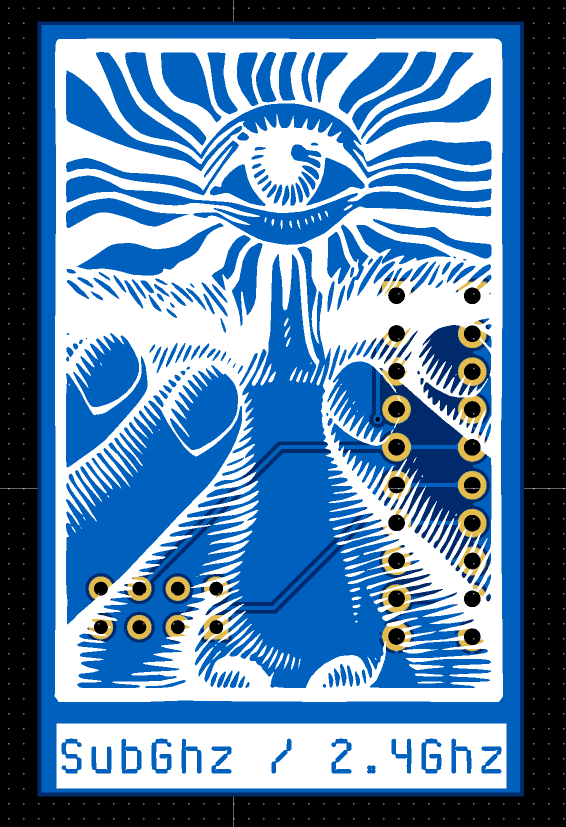

# SubGhz / 2.4 GHz Module

## Imagen

---

## Descripción

Módulo de comunicación **RF dual** que combina dos chips para cubrir un amplio espectro de frecuencias:

- **CC1101** (Texas Instruments): Comunicación Sub-GHz para controles remotos, sensores inalámbricos, sistemas de alarma y dispositivos IoT.
- **nRF24L01** (Nordic Semiconductor): Comunicación en banda 2.4 GHz para análisis de protocolos Wi-Fi, Zigbee y BLE.

---

## Características

### CC1101 (Sub-GHz)

- Chip **CC1101** de Texas Instruments
- Rango de frecuencias: **300-348 MHz**, **387-464 MHz**, **779-928 MHz**
- Bandas comunes soportadas:
  - 315 MHz (América)
  - 433 MHz (Europa/Asia)
  - 868 MHz (Europa)
  - 915 MHz (América)
- Modulaciones: 2-FSK, 4-FSK, GFSK, MSK, OOK, ASK
- Potencia de transmisión: hasta +12 dBm
- Sensibilidad de recepción: -116 dBm
- Interfaz: **SPI**

### nRF24L01 (2.4 GHz)

- Chip **nRF24L01** de Nordic Semiconductor
- Frecuencia de operación: **2.4 GHz ISM**
- 126 canales de RF
- Velocidades de transmisión: 250 kbps, 1 Mbps, 2 Mbps
- Modulación: GFSK
- Potencia de transmisión: hasta +0 dBm (versión PA+LNA hasta +20 dBm)
- Sensibilidad de recepción: -82 dBm a 2 Mbps
- Interfaz: **SPI**

---

## Casos de Uso

### Sub-GHz (CC1101)
- Captura y replay de señales RF (controles de garage, autos, alarmas)
- Análisis de protocolos inalámbricos propietarios
- Investigación de dispositivos IoT
- Fuzzing de receptores RF
- Ingeniería inversa de protocolos Sub-GHz

### 2.4 GHz (nRF24L01)
- Sniffing de tráfico 2.4 GHz
- Análisis de dispositivos Zigbee y BLE
- MouseJack (investigación de teclados/mouse inalámbricos)
- Inyección de paquetes en redes 2.4 GHz
- Investigación de protocolos propietarios en banda ISM

---

## Archivos

| Archivo | Descripción |
|---------|-------------|
| `SubGhz_Module.epro` | Proyecto EasyEDA Pro |
| `SubGhzModule.zip` | Gerbers para fabricación |

---

[← Volver al README principal](../README.md)
